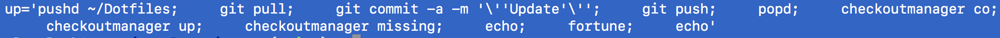
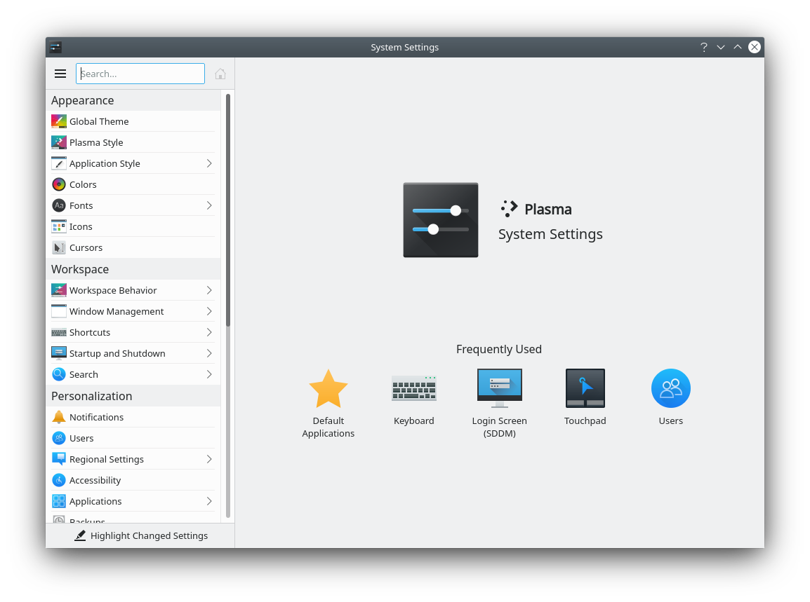

# Setup Linux

In just a few easy steps!

Kidding! Never easy enough, but not too bad either.

## Prerequisites

### Debian 12

Install Debian 12. 

### APT

Install additional packages.

```console
sudo apt install -y build-essential \
                    bsdmainutils \
                    curl \
                    nfs-common \
                    python3-pip \
                    python3-venv \
                    pipx \
	            whois \
                    xfishtank \
                    zsh
```

## Homebrew

Install Homebrew.

```console
/bin/bash -c "$(curl -fsSL https://raw.githubusercontent.com/Homebrew/install/HEAD/install.sh)"
```

Install additional packages.

```console
brew install fortune nvm
```

# pipx

Install additional packages.

```console
pipx install dotfiles
pipx install checkoutmanager
```

## Oh My Zsh

Install Oh My ZSH.

```console
sh -c "$(curl -fsSL https://raw.github.com/robbyrussell/oh-my-zsh/master/tools/install.sh)"
```

## Dotfiles

Requires [dotfiles](https://pypi.org/project/dotfiles) and GitHub Personal access token from [GitHub → Settings → Developer settings → Personal access tokens](https://github.com/settings/tokens).

```console
sh -c "$(curl -fsSL https://raw.githubusercontent.com/aclark4life/setup-linux/main/dotfiles.sh)"
```

## Firefox

Install add-ons.

- [Bitwarden Password Manager Add-On](https://addons.mozilla.org/en-US/firefox/addon/bitwarden-password-manager/)
- [React Developer Tools](https://addons.mozilla.org/en-US/firefox/addon/react-devtools/).

### Developer

Update dotfiles and repositories defined in [.checkoutmanager.cfg](https://github.com/reinout/checkoutmanager/blob/master/checkoutmanager/sample.cfg) via ``up`` alias.



```console
up
```

#### Postgresql

```
sh -c "$(curl -fsSL https://raw.githubusercontent.com/aclark4life/setup-linux/main/postgresql.sh)"
```

#### Node

```
nvm install 14
nvm use 14
```

#### GitHub

```
brew install gh
```

## More Steps

OK, I lied! More steps.

### sudo

`visudo` as root, add:

```
alexclark ALL=(ALL) NOPASSWD: ALL
```

### nfs

Add to `/etc/fstab`:

```
192.168.1.2:/Volumes/Technics   /technics       nfs     noauto  0       0
```

### Audio

Add kernel configuration via https://github.com/Focusrite-Scarlett-on-Linux/sound-usb-kernel-module.

```
echo "options snd_usb_audio vid=0x1235 pid=0x8212 device_setup=1" > /etc/modprobe.d/scarlett.conf
```

### System Preferences
                                     
Click your way to the finish.



#### Appearance

- Global Theme → Breeze Dark
